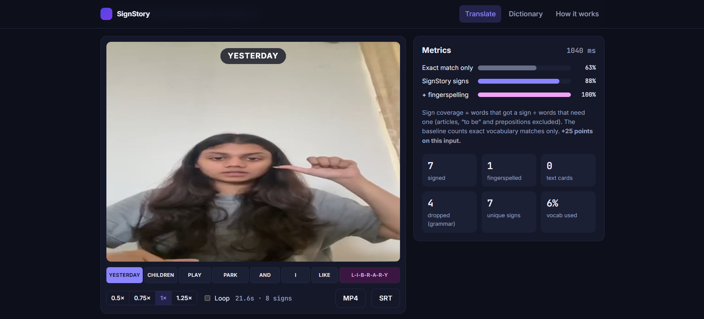
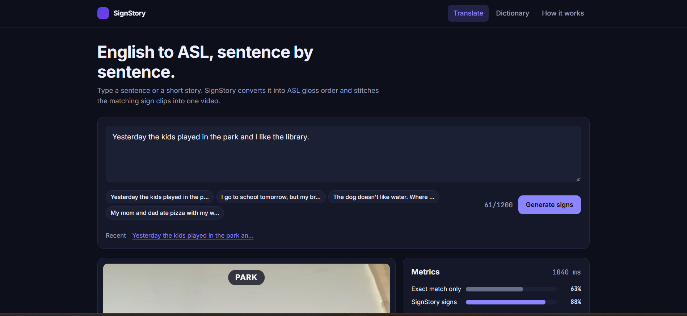
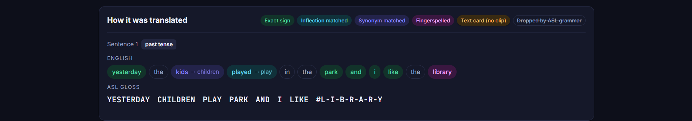

# SignStory

**English text → ASL gloss → sign-language video**, with a web UI that shows *how* every word was translated.

Type a sentence or short story. SignStory converts it into ASL word order (dropping articles and "to be", fronting time signs, moving wh-words last), matches each word to a sign clip, and stitches them into one video with synced captions.



## Features

- **ASL-aware NLP pipeline** – contraction handling, vocabulary-aware lemmatizer (`played → play`, `beaches → beach`), synonym map (`kids → children`, `mom → mother`), article/copula/auxiliary/preposition removal, time-first reordering, wh-word fronting, negation, tense detection.
- **Name detection** – capitalised words mid-sentence (`Rose`, `Maria's`) are fingerspelled even if they look like common words; days, months and holidays keep their signs, and Title Case or SHOUTED text is left alone.
- **Fingerspelling fallback** – words with no sign are spelled letter by letter (`#P-I-Z-Z-A`), with a pause between double letters and the active letter highlighted in the player. Uses public-domain ASL alphabet images (A–Z, see `fingerspelling/ATTRIBUTION.md`); any letter you replace or remove in `fingerspelling/` is picked up automatically, and missing letters fall back to letter cards.
- **No silent failures** – words that have their own ASL sign but no clip (`not`, `it`, wh-words…) show a labelled text card rather than being spelled wrongly, and the UI explains every decision (exact / inflection / synonym / fingerspelled / text card / dropped).
- **Synced playback** – word-level timeline, click-to-seek, speed control, loop, MP4 and SRT download.
- **Fast, cacheable rendering** – each clip is normalised once, then joined losslessly with FFmpeg; repeat requests return in milliseconds.
- **Sign dictionary** – searchable grid with hover previews and the synonyms mapped to each sign.
- **Shareable links** – `/?q=your+sentence` runs the translation on load.
- **Tested** – 29 tests (NLP rules and the API) for the NLP rules; reproducible evaluation script.

## Screenshots

| Compose a sentence | Signed video and metrics |
|---|---|
|  |  |

**How it was translated:** every word is labelled as an exact sign, inflection, synonym, fingerspelled or dropped by ASL grammar.



## Architecture

```
React + TypeScript (Vite)          FastAPI                          FFmpeg / OpenCV
┌──────────────────────┐   JSON   ┌──────────────────────────┐     ┌─────────────────┐
│ Composer · Player     │ ───────▶ │ /api/translate           │ ──▶ │ normalise clips │
│ Pipeline · Metrics    │ ◀─────── │  gloss.py  lemmatizer.py │     │ concat (copy)   │
│ Dictionary            │  MP4/VTT │  pipeline.py render.py   │ ◀── │ text cards      │
└──────────────────────┘           └──────────────────────────┘     └─────────────────┘
```

| Path | Purpose |
|---|---|
| `backend/app/gloss.py` | Tokenising, matching and ASL grammar rules |
| `backend/app/lemmatizer.py` | Vocabulary-constrained lemmatizer (never invents words) |
| `backend/app/lexicon.py` | Synonyms, irregular forms, dropped-word lists |
| `backend/app/fingerspell.py` | Letter assets, letter cards, spelled-word clips and per-letter timings |
| `backend/app/render.py` | Text cards, clip normalisation, concat, SRT/VTT |
| `backend/app/pipeline.py` | End-to-end translate + metrics |
| `backend/app/main.py` | FastAPI routes; also serves the built UI |
| `backend/eval/evaluate.py` | Baseline vs SignStory evaluation |
| `frontend/` | React UI |
| `vocab.txt`, `vocab_wlasl.txt` | The 46 hand-curated words and the 81 words added by `tools/build_signs.py` |
| `asl_videos_std/`, `asl_videos_wlasl/` | The sign clips for those words. **Not in the repository** (see below) |
| `backend/tools/build_signs.py` | Automatic vocabulary expansion from downloaded WLASL videos |
| `fingerspelling/` | Optional alphabet assets (a–z) |
| `legacy/` | The original CLI / Tkinter prototype, kept for reference |

## Getting the sign clips

The sign clips come from WLASL, which is licensed for research use and shows real people, so **they are not committed to this repository**. Without them the app still runs and fingerspells every word (the alphabet images are included), and the UI says so. To add real signs:

1. Get the [WLASL](https://github.com/dxli94/WLASL) metadata and download the videos you want into `WLASL/raw_videos/` (WLASL's `video_downloader.py`; many source links are dead, so expect only a subset).
2. Build the clips:
   ```bash
   cd backend
   python -m tools.build_signs
   ```
   This writes `asl_videos_wlasl/` (and refreshes `vocab_wlasl.txt`). Every word with a usable downloaded video gets a sign.
3. Optional: place your own curated clips as `asl_videos_std/<word>.mp4` (words listed in `vocab.txt`); these take priority.

The 127-sign vocabulary and the evaluation numbers below refer to my local set, built this way. The tests and the evaluation script only need the committed word lists, so they run without clips.

## Quick start

Requirements: Python 3.10+, Node 18+. Optional: the sign clips (see above). FFmpeg is bundled via `imageio-ffmpeg`, so nothing else to install.

```bash
pip install -r backend/requirements.txt
cd frontend && npm install && npm run build && cd ..
cd backend && python -m uvicorn app.main:app --port 8000
# open http://127.0.0.1:8000
```

Windows shortcut: `./run.ps1`.

### Docker

```bash
docker compose up --build     # http://localhost:8000
```

Multi-stage build (Node builds the UI, a slim Python image serves everything), runs as a non-root user, has a health check, and keeps rendered videos in a volume. The image is ~680 MB. For UI development run the backend as above and `npm run dev` in `frontend/` (Vite proxies `/api` and `/media` to port 8000).

Continuous integration (`.github/workflows/ci.yml`) runs the tests, the evaluation, the frontend lint and build, and the Docker build on every push.

Tests and evaluation:

```bash
cd backend
python -m pytest -q
python -m eval.evaluate
```

## API

| Method | Route | Description |
|---|---|---|
| `POST` | `/api/translate` | `{ "text": "..." }` → per-sentence tokens/gloss, timeline, video/SRT/VTT URLs, metrics |
| `GET` | `/api/vocab` | Available signs and their mapped synonyms |
| `GET` | `/api/alphabet` | Fingerspelling letters and which have hand-shape assets |
| `GET` | `/api/health` | Liveness + vocabulary size |

Interactive docs at `/docs`.

## Evaluation

`python -m eval.evaluate` compares two vocabularies on two sets of 20 sentences. **Sign coverage** = words that receive a sign ÷ words that need one (articles, "to be", auxiliaries and prepositions are excluded because ASL does not sign them). "Conveyed" also counts fingerspelled words. "Exact-only" is the like-for-like baseline: exact vocabulary matches over the same denominator.

| Sentence set | Vocabulary | Exact-only | Real signs | Signs + fingerspelling | Fully conveyed |
|---|---|---|---|---|---|
| Written around the original 46 words | 46 (curated) | 60.3% | 89.0% | 94.6% | 15/20 |
| Written around the original 46 words | 127 | 60.3% | 89.0% | 94.6% | 15/20 |
| **General everyday sentences** | 46 (curated) | 21.7% | 32.4% | 89.5% | 10/20 |
| **General everyday sentences** | **127** | 55.8% | **75.3%** | **93.0%** | **13/20** |

What this shows:
- Lemmatisation, synonyms and grammar rules lift coverage on the original set from 60.3% to 89.0%.
- On general text, expanding the vocabulary from 46 to 127 signs takes real-sign coverage from 32.4% to 75.3%. Fingerspelling already kept most words conveyed at 89.5%, but as spelling rather than signs.
- The first set is written around the old vocabulary, so it cannot show any benefit from a larger one. It is kept to show the NLP gain.

Caveats: the sets are small and written by the author, and I added the `forgot/gave/told/met` irregular verbs after seeing the general set's misses, so its numbers are slightly optimistic. The metric measures vocabulary coverage, not signing correctness; that would need review by fluent ASL signers.

## Building the vocabulary

`python -m tools.build_signs` adds signs from WLASL videos you have already downloaded. For each gloss not in the hand-curated set it filters out corrupt files and unusable clips, scores the remaining candidates by sharpness, trims to the annotated frame range, crops to the signer, standardises to 640x480 @ 30 fps, and writes `asl_videos_wlasl/` plus a `_manifest.json` recording each clip's source. 18 words with several unrelated English senses (`can`, `right`, `check`, `orange`…) are skipped on purpose, since fingerspelling them is safer than showing a possibly wrong sign. Hand-curated clips always take priority.

## Limitations

- Closed vocabulary of 127 signs (46 curated + 81 built from WLASL). Everything else is fingerspelled, which is how ASL treats names and loanwords but is not idiomatic for common words, so a larger vocabulary still matters.
- Fingerspelling uses still line-art images, so J and Z show a motion arrow rather than the actual movement. Short clips per letter would fix that (`fingerspelling/README.md`). Name detection is a capitalisation heuristic: a name at the start of a sentence looks like any other capitalised word, so it is only spelled if it is not in the vocabulary.
- Rule-based grammar: it handles the common ASL rules above, not classifiers, non-manual markers or spatial grammar. It is a gloss-level translation, not full ASL.
- Clips come from different signers, so the video is a sequence of individual signs rather than one continuous signer.

## Roadmap

- Download more WLASL videos (only ~120 of 2,000 glosses are local) and re-run the build tool to grow the vocabulary
- LLM story simplification to vocabulary-friendly sentences
- Speech input (Whisper) and crossfades between signs
- Hosted demo (blocked on the clip-licence question below)

## Data and licence

Fingerspelling images are the ASL manual alphabet from Wikimedia Commons (public domain, artwork from wpclipart.com); per-file links are in `fingerspelling/ATTRIBUTION.md`.

Sign clips (`asl_videos_std/`, `asl_videos_wlasl/`) come from the [WLASL dataset](https://dxli94.github.io/WLASL/). WLASL is distributed for computational/research use; check its terms before redistributing the clips or making a public demo, and credit the authors (Li et al., WACV 2020).
